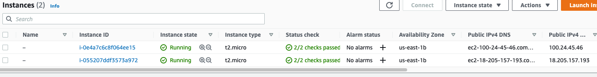
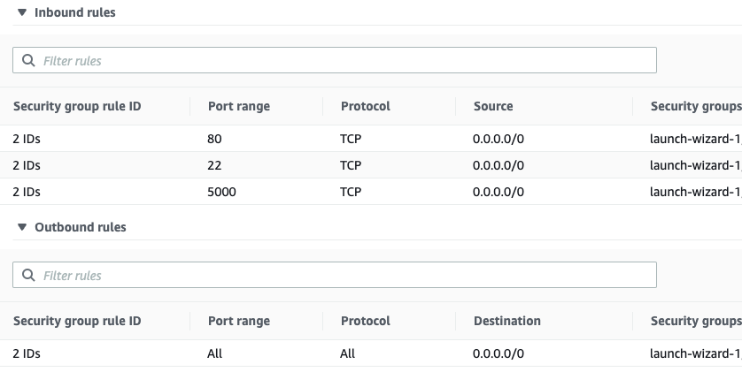
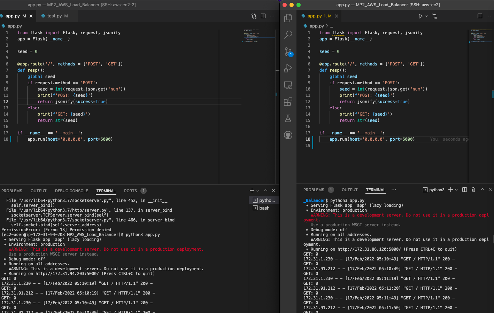
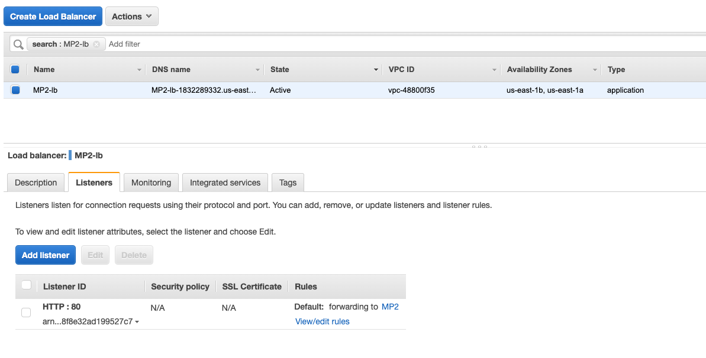
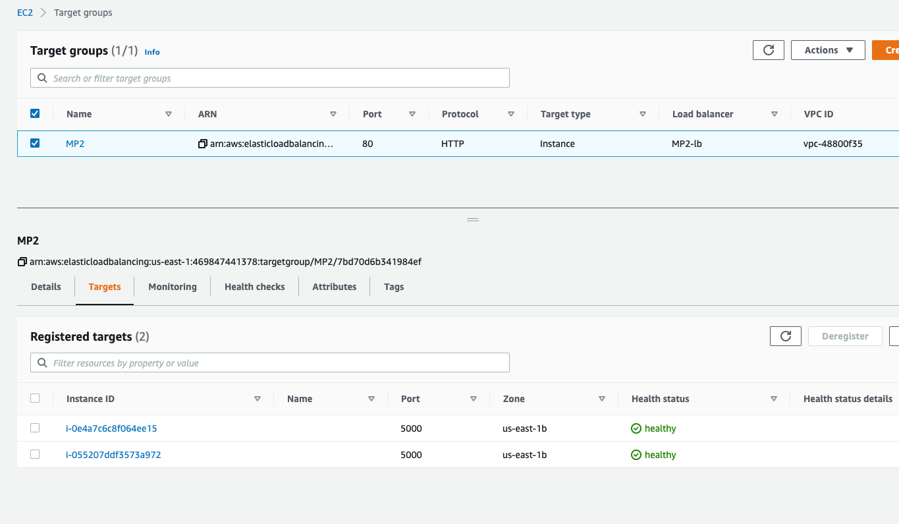
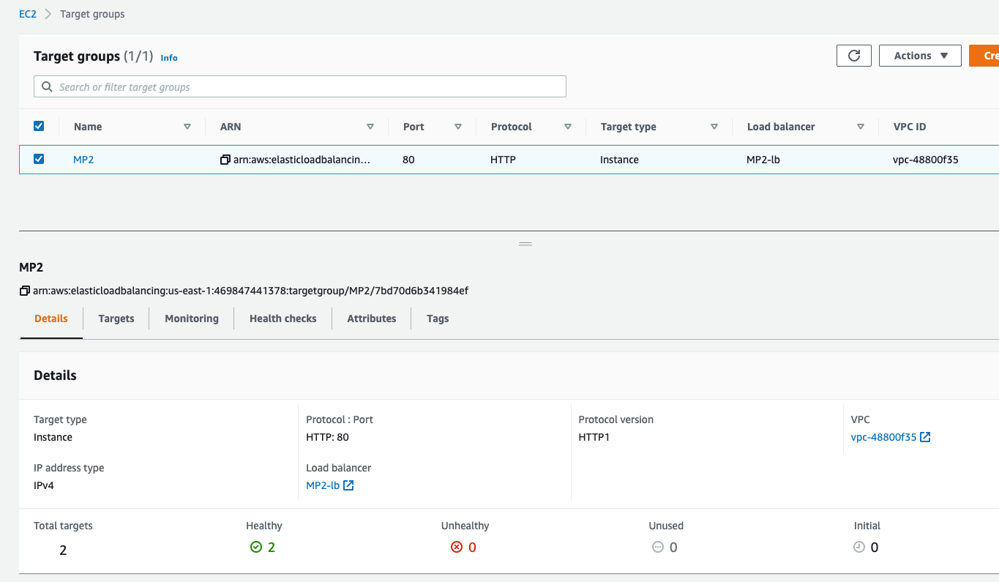

# Load Balancer Setup

## Web application on AWS EC2

1. Launch two EC2 instances. Ensure that you use the same security group. [Step-by-step](https://docs.aws.amazon.com/AWSEC2/latest/UserGuide/EC2_GetStarted.html)

2. Modify the inbound firewall rules (HTTP over Port 5000 using TCP is custom) to make them reachable for the load balancer and the public:
  
    

3. Run the requirments.txt file to load dependencies, new to flask? Here's a [guide](https://www.tutorialspoint.com/flask/index.htm). Refer to the sections of Environment and HTTP Methods.

4. Ensure you can connect to the 2 EC2 instances using terminal (or the embedded terminal in the EC2 console on your browser) via ssh.
  I have written a simple web server application that stores and retrieves a seed value (default 0). This program will then run on each EC2 server. Specifically, your server should maintain the seed number and allow clients to access and update it. The application handles the following two HTTP REST requests:

    `HTTP POST "/" with JSON body {"num": 100} where 100 can be any integer.`

    The program should update the seed value with the given number.

    `HTTP GET "/"`

5. The program, i.e. app.py, should return the integer seed value in string format. The response body for the above case will be: "100"
  

6. The web application will run on a specific port and be deployed in both EC2 instances. Note the IP in the terminal is the subnet IP and is inaccessible. Use the EC2's public IP.

## Load balancing web servers

1. We will launch an AWS Application Load Balancer, which will allow us to distribute HTTP requests between the two instances that were just initiated. To get started, go over [this](https://docs.aws.amazon.com/elasticloadbalancing/latest/application/application-load-balancer-getting-started.html
) document. 

2. Connect your load balancer to a target group with the previously launched EC2 instances. Make sure to map the webserver port to the load balancer correctly.
  
  
3. When configuring the load balancer, ensure not to use the default security group. Enable the HTTP protocol and allow traffic to be routed from anywhere when creating a custom security group. You will not pass this assignment unless our autograder can connect to your system via the internet.
  
4. To check if your load balancer is running correctly, first make sure that the two EC2 instances are healthy in the target group, and then go to the DNS address listed in the AWS load balancer's description and look for the seed value.
  

## FAQ
1. Load balancer - Failing security checks? Check [this](http://flask.palletsprojects.com/en/1.1.x/quickstart/#quickstart) out!
`$ flask run --host = 0.0.0.0`
2. Unable to connect to Ec2 from local machine:
You don't need to connect to your ec2 using a web browser. You can connect via command line.
If you want to ping your flask server, you need to include the port number that the flask server is running on
3. 501 Not Implemented - Failed to connect to load balancer.
Try deleting the http:// part of your load balancer address in test.py
Not supposed to add port number to load balancer url.
4. Load Balancer: EC2 Instances - "OutOfService"
  Ensure to login to EC2 instances via ssh and then run server.py code
5. Execution of test.py leads to connection timeout:
Do not run test.py script on the same ec2 instance. Run the test.py program from the local terminal. I.e. Final step has to be done on a separate instance or
your local machine. It should not be done on the any of the two ec2 instance
6. 502 Internal Error and No traffic goes to the ec2 instances
Looks like the security groups in the load balancer had to be changed to allow all traffic.
Using application load balancer instead of classic
Not able to parse the num value you are sending because it is being received as a byte literal such as this: b'"1000"\n'
flask server is returning bytes format of a string instead of just the string itself
